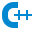
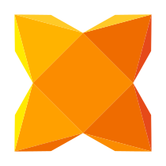
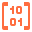
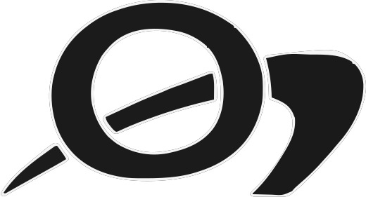
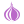
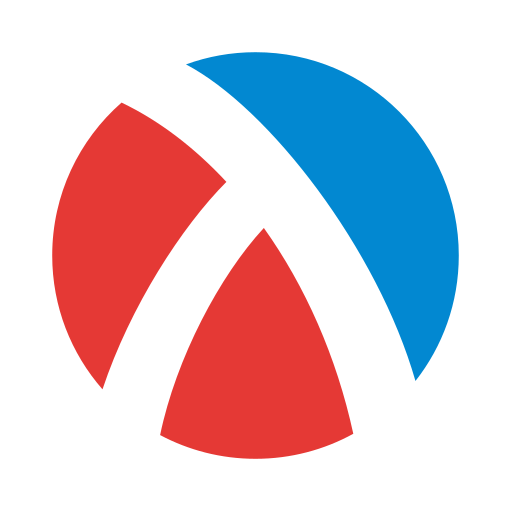

# Algorithms Grab-bag

 

 

 

This is just a fun little project for myself to write a bunch of algorithms and data
structures in a bunch of different languages. Why not?

I am reading through Knuth's The Art of Computer Programming, serving as
the primary source for algorithms that appear in here. Instead of just doing
the MMIXAL alone (although it is included), I have decided to add a bunch
of other languages to learn the algorithms and techniques in even more
depth.

The languages that I am interested in are ones that are not too amazingly difficult
to setup to build and run a single file at a time. Sometimes that is a little bit
more convoluted than other times, but I am not interested in creating whole projects.
Each file is rather to be its own standalone and follow common patterns.

For MMIX and NASM, I have decided to start collecting a small standard library
of methods that can be linked in. This is in stdlib/. I am mostly favoring
my own implementation including syscall routines instead of linking to libc.
Because of this, there are 2 scripts used to link in the standard library and
run the code. Both scripts take the file to be run and assembles and links them,
passing all other command line arguments directly to the final execution.

## Languages

I explore many different languages. This is a rough list that may more may not be entirely up to date ever.
 to date ever.

-  Ada
-  C
-  C++
-  C#
-  Clojure
-  COBOL
-  D
-  Dart
-  Erlang
-  Elixir
-  F#
-  FreeBASIC
-  Fortran
-  Go
-  Haskell
-  Java
-  Javascript
-  Julia
-  Kotlin
-  Lua
-  MMIXAL (Assembly Language for Donald Knuth's MMIX)
-  Modula-3
-  NASM (x86_64 Linux ASM)
-  Objective-C
-  Ocaml
-  Perl
-  PHP
-  Python
-  R
-  Ruby
-  Rust
-  Scala
-  Scheme
-  Simula
-  Swift
-  Typescript

### Additionally, currently in Hello World

-  Factor
-  Forth
-  Haxe
-  Idris2
-  Kit
-  Mercury
-  Mojo
-  Nim
-  Oberon
-  (Free/Object) Pascal
-  Prolog
-  Racket
-  Smalltalk
-  V
-  Visual Basic .Net
-  Zig
