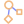
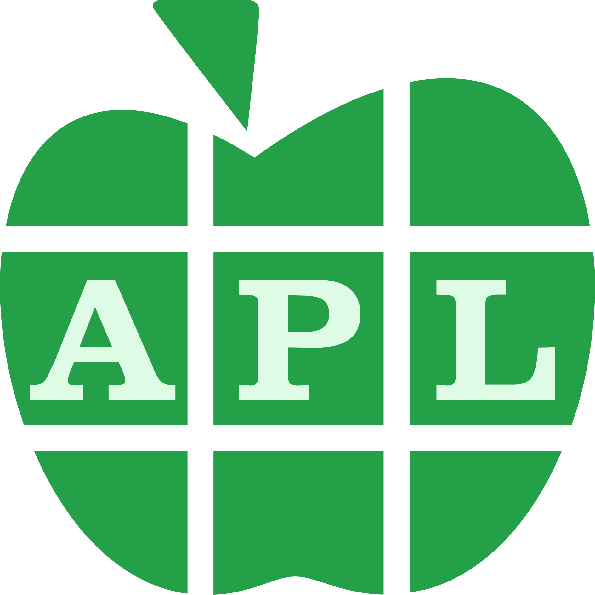
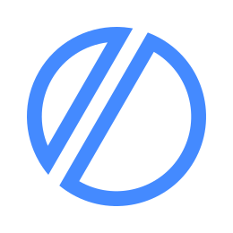
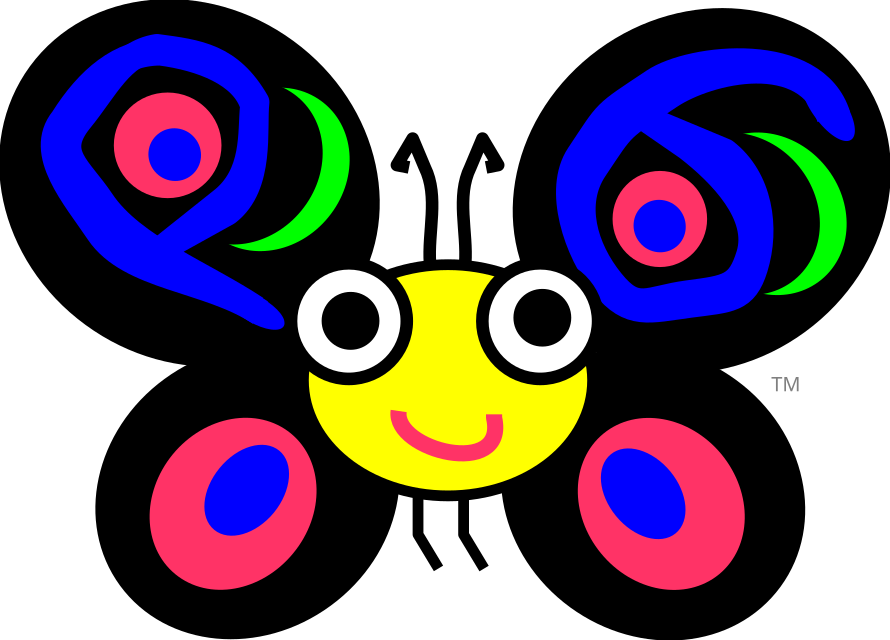
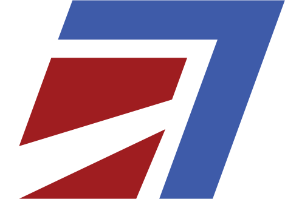
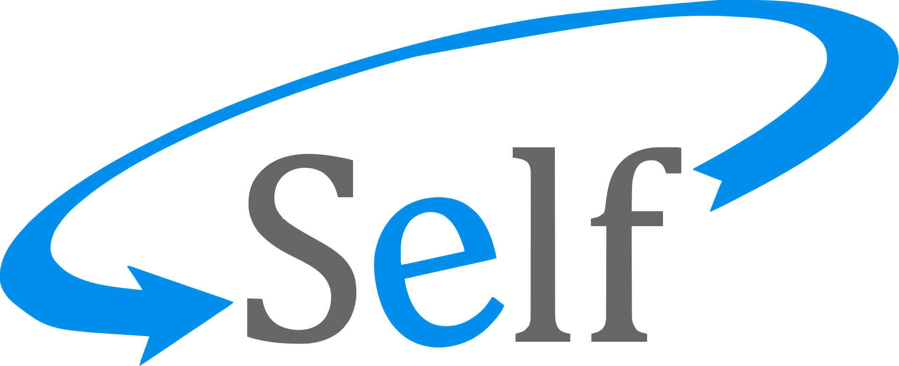

#  Algorithms

<p align="center">















</p>

[GitHub Project](https://github.com/derekshoneycutt/algorithms)

[Analysis Pages](https://derekshoneycutt.github.io/algorithms/)

This is just a fun little project to write a bunch of algorithms
and data structures in a bunch of different languages. I have also decided
to start doing some writings about the experience, trying to do some kind of
amateur analysis of what is being said and so on.

Why not?

I am reading through Knuth's The Art of Computer Programming, serving as
the primary source for algorithms that appear in here. Instead of just doing
the MMIXAL alone (although it is included), I have decided to add a bunch
of other languages to learn the algorithms and techniques in even more
depth. I figured I can make this public, maybe it will benefit someone.
Mostly it is unabashedly for my own entertainment, though. I will not try to
do all of Knuth's examples and exercises, and I make not promises about doing
them in Knuth's style, either. Reading Knuth is my guide, but I am totally
free to do my own thing here as well.

**NOTE**: The current code is in progress with some algorithms further ahead
than the formal current position. Mostly, this is because of unsure exactly
what I was doing at first and have been solidifying it with further enhancements.
Euclid GCD is complete while Max is currently under progress. As I catch
up, this should be reduced to a single algorithm ahead at times, perhaps with
some MMIX (and assembly stdlib) exploring otherwise.

## Architectural Notes

Initially, this was just a bunch of code files, but it has called for me to
make a development environment and overall architectural decisions that make
working with and identifying errors in the various languages easier. There are
some 60 languages included in this project, and the development environment
quickly becomes messy and difficult without a central management. Any other
algorithms at this time might be broken or not in the desired final position;
Euclid GCD is approaching complete.

### Architectural Setup of the Project

The general architecture is that algorithms are sorted into a category with a directory
under `src/`. Each algorithm then has a single directory named after itself, which
contains *one* single code file for that algorithm per language.
Each file contains enough to complete the algorithm in question.

Beyond this, the architecture of each language necessarily varies significantly.
I do typically try to explore somewhat similar concepts. For example,
lazy evaluation in functional languages can often mimic the behavior of
coroutines in other languages, while other languages require an explicit state machine
to mimic the behavior. These may be explored next to each other while focusing
on a simple date calculation algorithm. However, some times there is a wonderful
way to express a solution in a language separately from how many other languages may
favor more traditional procedural approaches.

### On the development environment

The recommended way to setup the system for the first time is to just call the
init script right off the git. This will clone the git and set up environment
variables for you, as well as copy the icons to a useable folder for the material
icons theme extension. On Windows, you will need git bash, msys, WSL, or something similar
to run sh scripts in a sane environment.

```sh
curl -sSL https://raw.githubusercontent.com/derekshoneycutt/algorithms/refs/heads/main/init.sh | sh
```

Once installed, you can navigate to the base directory of the git project at any time and
run `./init.sh` in an sh terminal. This will provide a prompt that you can interactively
set the various environment variables, re-copy the icons (to a different if you like), etc.
See `./init.sh --help` for tips on using the script non-interactively as well.

If you open the folder in VS Code, you should get a recommendation list for
the extensions that are used throughout this project. This should be enough to
have a basic environment to code in. To see this list, go to the Extensions tab
and search for `@recommended`. You can select which to install from this list.

There is also a custom VS Code extension built just for this project that makes it easy
to manage and navigate. You can run `npm run buildextension`
from the git repository root directory, and this extension will be built into
`extension/dist/algorithms-runner-extension-0.0.1.vsix` for example.

What is missing to work with the project from there is just all the code compilers.

I highly recommend setting up docker so that you can just build the Dockerfile.
The entire build environment setup can be viewed in the
[System-setup](System-setup.md) document for deeper builds, but it is harder to get
a system going from scratch instead of just using a reproducible docker.

```sh
./init.sh --no-prompt --no-icons --skip-environment --build-docker
```

The docker built from this is quite sizable, as should probably be expected from
containing the compiler and runtimes for 60 different programming languages. It
tends to build fastest on a multicore linux machine in my experience, but then it
is about 8.4GB saved into a .tar.gz to transfer to other computers.

The `run.sh` is setup to be called from any old
shell by navigating to a folder with code files and calling the run script
pointed to the desired file. The language to compile and run is based on the
extension of the filename passed in. Any additional arguments will be passed to
the application when it is run, as command line arguments.

The included VS Code extension does this manually, and the settings are also configured
to use this run script via the Jun Han Code Runner extension. Either is a valid
option here.

```bash
cd $dir && ../../../run.sh $fileName [additional argments]
```

Some options are available exclusively as flags in the first command line argument
position to the run script. See `../../../run.sh --help` for the options
that are available. Of note, `--source-profile="FILE"` allows changing the `.profile`
like file that is sourced for environment variables at the start of the script, and
`--check-only` will only pretend to compile and run the specified code.

`clean` is a special "fileName" that performs a clean operation for
the current directory. It should be called from a code directory, and will delete
the output subdirectory cleanly in that location, as well as performing any other cleanup.

With the addition of ARM64 assembly targeting Apple/MacOS, it is not easily
possible to run every single code file on a single computer for this project.
With support for Linux, FreeBSD, and Windows on x86-64, this was already
stretched, but most code could run on any of those. Now, I just use a docker
and multiple computers.

NOTE: On FreeBSD and MacOS, the run script uses `gdate` when available, which you can
install simply via `sudo pkg install gdate` or `brew install coreutils`. If this is not
available, the script will fall back to `date` and report only seconds instead of milliseconds.

### Standard Library

For MMIX and Assembly, I have decided to start collecting a small standard
library of methods that can be linked in. This is in `stdlib/`. I am mostly
favoring my own implementation including syscall routines instead of linking
to libc.

Native assembly follows the native platform's norms for parameters. For
example, FreeBSD and Linux share a rdi, rsi, etc. register pattern for
parameters, while Windows is rcx, rdx, etc. In NASM, assemble-time macros
can be utilized with register aliases via `%define` to ensure correct ABI
is being used in code. In GAS/AT&T assembly, a special assemble-time variable
is passed to the assembler, WINDOWS, which is 1 if on Windows, or 0 otherwise.
`.if` clauses are then used with `.equiv` clauses to alias the registers.
As for ARM64, this follows the standard x0, x1, etc. pattern.

Because this does not use libc, the standard library now includes a custom
`_start` entry point for each assembly language (except MMIX). This creates a
setup similar to C's `main` method where the first parameter is the number
of command line arguments (including the exe name), and the second parameter
is the array of command line argument strings. These should be treated as
immutable system managed variables, even though, for example, in Windows
this is actually managed by the standard library.

This is mostly an educational project, so we can use the direct syscall
type methods instead of libc. On Windows, we use kernel32, etc. type calls
instead, for good practice. On Linux and FreeBSD, the syscalls are stable.
On MacOS, we just use the potentially problematic syscalls. Apple does provide
POSIX compatibility, which we follow, but considers the details private
and recommends using libc.

## On Analysis

The starting point of this project is and will continue for some time to
be me reading through Knuth and wanting to explore some of the algorithms
and exercises myself in my own, fun way.

That said, I am me. I have been writing code since I was something like 8
years old, professionally for most of my adult life.
At the same time, my (BA) degree is in psychology (and math), I enjoy
reading a lot, and I enjoy writing about my own experiences.
This all leads me to want to give a direction to this project that
includes writing an analysis about my experience and what programmers
are trying to tell each other with the different styles I am playing
with. Through this project and my unique background, I think that
I can contribute something new and different in an analysis.

This will also give me an opportunity to explain what my thoughts are in
writing each piece of code the way I did. There are choices made
along the way, some of which are not immediately obvious from the
code alone.

There are a few major principles that will be central to these analyses.

No langauge is **right**. No language is **wrong**. Each language lives in
a historical moment and within a meaningful philosophy that can be
respected and enjoyed in this project without demanding anything about
one having any superiority over another. This analysis is not interested in
how people have misused languages in terms of bad code, and it is not
overly concerned in whether this project misuses code in that negative sense.
This analysis is more likely to be curious about how code is misused
in society, although there is likely limited chance for it in this
project. The goal of these analyses is just a curious comparison of
the different experiences of the languages. Principle number one is to have fun.

If any time these principles seem to be clearly in violation or
just incoherently applied, that is the entire fault of myself, the author.

These analyses have a necessarily phenomenological basis.
The interest in this project is in pointing out the experienced differences
between the languages and beginning to explore some underlying semantic
interests in how programmers use these different languages to construct and
exercise different meanings between themselves and other programmers.
Semantics often has a meaning within
programming languages that somewhat escapes the goal of this project, but
some traditional semantic speak will be apparent, especially early on. Rather
than the typical "semantics" within programming languages, however, this is
going to attempt to approach a kind of social semantics of code that is more
interested in the experiences of making interpersonal meaning through
code. Included in this is the experience of perceiving the social meaning
made by others in code, including the perceived intent of the designers of
the languages used. The computer is another actor that necessarily limits and
acts upon part of this meaning, but there are many opportunities to explore
the irrational human meaning in my analysis, which I hope to focus on more.

There is not an effort to make an analytical or statistical analysis of
the languages in this project. There is ample space to explore that, as is
apparent in research literature. This is often focused on the semantics
of what code intends to do on the computer, but some analysis of impact on
development time and maintenance concerns also suggests some analytical
and statistical techniques could be applied to the goals of this project. I am
simply choosing to take a more simple route to begin. There is little truly
rigorous about the analyses I wish to provide here, though I hope the empirical
basis of the project adds more than I immediately seek to provide myself.
As for analysis of the actual algorithms used, I would point firmly at reading
Knuth, who does a masterclass of algorithmic analysis in *The Art of Computer
Programming*, where I am picking the algorithms from.

If someone derives some benefit or enjoyment out of my ramblings here,
then that is quite wonderful. If we include myself, then the project
is already a success!

## Languages

\* Code in the following refers to the language code used locally within the
run.sh script.

| Icon | Language | Extension | Code* | Build Tool | Etc |
| --- | -------- | --------- | ----- | ---------- | --- |
|  | Acton | .acton | acton | Acton | |
|  | Ada | .adb | ada | GNAT toolchain, gnatmake | |
|  | APL | .apl | apl | Dyalog | |
|  | ARM64 | .s | arm64asm | Apple Clang, Apple linker; as, ld | ARM64 Assembly, targeting Apple Hardware |
|  | AT&T/GAS | .asm | asm | GNU Assembler, GNU linker; as, ld | x86_64 Assembly (Linux, FreeBSD, Windows) |
|  | Ballerina | .bal | ballerina | Ballerina, bal; java | |
|  | C | .c | c | GCC | |
|  | C3 | .c3 | c3 | C3C | |
|  | C++ | .cpp | cpp | GCC, g++ | |
|  | C# | .cs | csharp | dotnet | |
|  | Common Lisp | .lisp | clisp | Steel Bank Common Lisp | |
|  | Clojure | .clj | clojure | Leiningen, lein exec | |
|  | COBOL | .cbl | cobol | GNU COBOL, cobc | |
|  | D | .d | d | dmd | |
|  | Dart | .dart | dart | dart | |
|  | Eiffel | .e | eiffel | EiffelStudio | open source compiler can be used free only for open source code |
|  | Elixir | .exs | elixir | elixir | |
|  | Erlang | .erl | erlang | erlc, erl | |
|  | F# | .fs | fsharp | dotnet | |
|  | Factor | .factor | factor | factor | |
|  | FreeBASIC | *.bas | freebasic | fbc | |
|  | Forth | .fth | forth | GNU Forth, gforth | |
|  | Fortran | .f90 | fortran | GNU Fortran, gfortran | |
|  | Gleam | .gleam | gleam | gleam | |
|  | Go | .go | go | go | |
|  | Haskell | .hs | haskell | Glasgow Haskell Compiler, runghc | |
|  | Haxe | .hx | haxe | haxe | |
|  | Icon | .icn | icon | icon | |
|  | Idris2 | .idr | idris | idris2 | |
|  | Io | .io | io | Io, wasi-sdk, wasmtime | |
|  | J | .j | j | J, jconsole | |
|  | Java | .java | java | Java | |
|  | Javascript | .js | javascript | node | |
|  | Joy | .joy | joy | Joy | |
|  | Julia | .jl | julia | julia | |
|  | Kit | .kit | kit | kit | |
|  | Kotlin | .kt | kotlin | kotlinc, java | |
|  | LLVM IR | .ll | llvmir | clang | |
|  | Lua | .lua | lua | lua | |
|  | Mercury | .moo | mercury | Melbourne Mercury Compiler, mmc | |
|  | MMIXAL | .mms | mmixal | Knuth's; mmixal, mmix | ASM for Knuth's MMIX simulated RISC CPU |
|  | Modula-3 | .m3 | modula3 | Critical Mass Modula-3, cm3 | |
|  | Mojo | .mojo | mojo | pixi, mojo | mojo installed via pixi |
|  | NASM | .nasm | nasm | The Netwide Assembler, GNU linker; nasm, ld | x86_64 Assembly (Linux, FreeBSD, Windows) |
|  | Nim | .nim | nim | nim | |
|  | Oberon | .Mod | oberon | Vishap Oberon Compiler, voc | |
|  | Objective-C | .m | objectivec | clang | |
|  | Ocaml | .ml | ocaml | ocaml | |
|  | Octave (MATLAB) | .mat | octave | octave | copies to (name)shaved.m extension in output before running |
|  | Odin | .odin | odin | odin | |
|  | Pascal (Free/Object) | .pas | pascal | Free Pascal, fpc | |
|  | Perl | .plx | perl | perl | |
|  | PL/I | .pl1 | pli | Iron Spring Software PL/I Compiler | |
|  | PHP | .php | php | php | |
|  | Prolog | .pl | prolog | GNU Prolog compiler, gplc | |
|  | Python | .py | python | python | |
|  | Q'Nial | .nls | qnial | Q'Nial, nial64 | |
|  | R | .r | r | R, Rscript | |
|  | Racket | .rkt | racket | racket | |
|  | Raku | .raku | raku | Rakudo | |
|  | Rhombus | .rhm | rhombus | racket | |
|  | Ruby | .rb | ruby | ruby | |
|  | Rust | .rs | rust | rustc | |
|  | Scala | .scala | scala | scala | |
|  | Scheme | .scm | scheme | GNU Guile, guile | |
|  | Self | .self | self | Self, Self VM, Self World | |
|  | Simula | .sim | simula | GNU Cim, cim | |
|  | Smalltalk | .st | smalltalk | GNU Smalltalk, gst | |
|  | Swift | .swift | swift | swift | |
|  | Tcl | .tcl | tcl | tclsh | |
|  | TypeScript | .ts | typescript | tsc, node | |
|  | V | .v | v | v | |
|  | Visual Basic .Net | .vb | visualbasic | dotnet | |
|  | Web Assembly (WASM) | .wat | wat | wabt, wat2wasm; node | In WAT Lisp dialect |
|  | Zig | .zig | zig | zig | |

## Icons

The icons shown here, and which I have configured in my VSCode setup for this project,
come from 2 primary sources. One is the
[Material Design Icon Theme Extension](https://github.com/material-extensions/vscode-material-icon-theme),
which serves as the base. That theme includes far more icons that are included,
but it does not have all of the languages listed here. Some of the other icons
were pulled off the internet and the best representation I could find on the
official website, or the closest thing to it. In order to make them work,
sometimes I used basic online tools to change transparent backgrounds and
convert to svg. A few also came courtesy of the VSCode extension for the
language, such as the Simula and LLVM IR logos.

I make no claim to originality in the icons. While they make my README look nice,
they're included here moreso because they make my VS Code look nice. I highly recommend
the above stated extension. Any that you cannot find there, look for the language
extension with the logo included, or feel free to use the one I probably scavanged
via the online tools with no promises or charge.

## MIT License

The code in here is open source, under the MIT license.

Copyright (c) 2026 Derek Honeycutt

Permission is hereby granted, free of charge, to any person obtaining a copy
of this software and associated documentation files (the "Software"), to deal
in the Software without restriction, including without limitation the rights
to use, copy, modify, merge, publish, distribute, sublicense, and/or sell
copies of the Software, and to permit persons to whom the Software is
furnished to do so, subject to the following conditions:

The above copyright notice and this permission notice shall be included in all
copies or substantial portions of the Software.

THE SOFTWARE IS PROVIDED "AS IS", WITHOUT WARRANTY OF ANY KIND, EXPRESS OR
IMPLIED, INCLUDING BUT NOT LIMITED TO THE WARRANTIES OF MERCHANTABILITY,
FITNESS FOR A PARTICULAR PURPOSE AND NONINFRINGEMENT. IN NO EVENT SHALL THE
AUTHORS OR COPYRIGHT HOLDERS BE LIABLE FOR ANY CLAIM, DAMAGES OR OTHER
LIABILITY, WHETHER IN AN ACTION OF CONTRACT, TORT OR OTHERWISE, ARISING FROM,
OUT OF OR IN CONNECTION WITH THE SOFTWARE OR THE USE OR OTHER DEALINGS IN THE
SOFTWARE.
