# Algorithms

<p align="center">

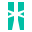


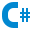
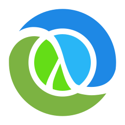


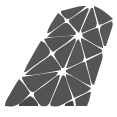


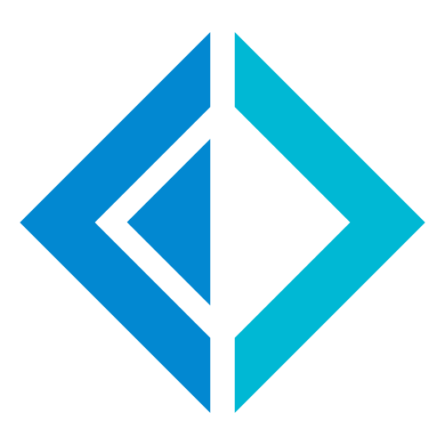

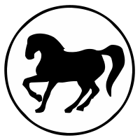 

 
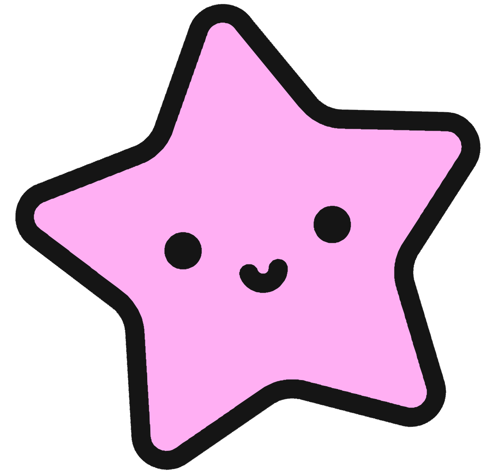

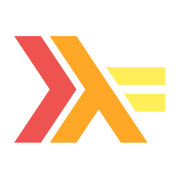

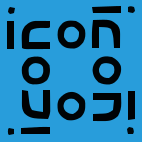


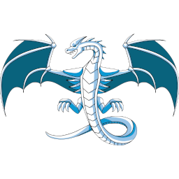

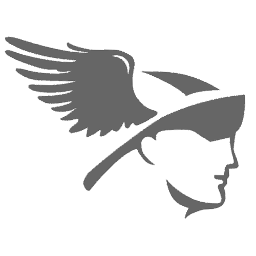

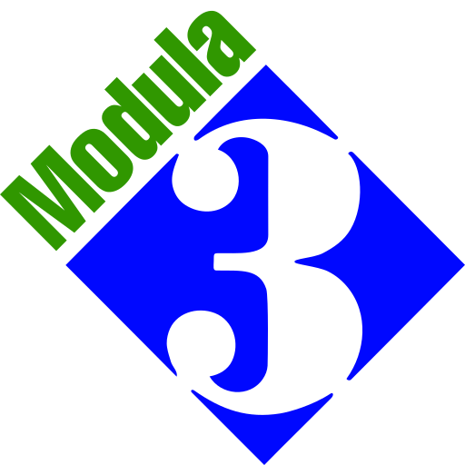


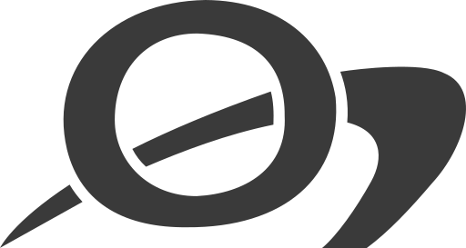
 

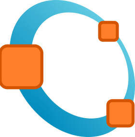


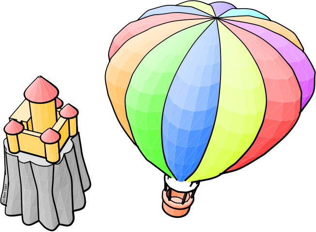


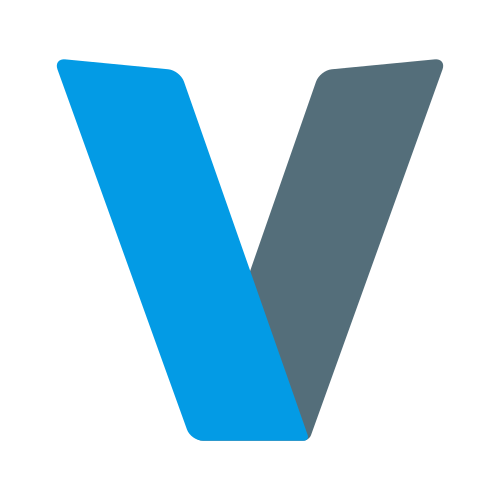

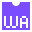

</p>

This is just a fun little project to write a bunch of algorithms and data structures in a bunch of different languages.

Why not?

I am reading through Knuth's The Art of Computer Programming, serving as
the primary source for algorithms that appear in here. Instead of just doing
the MMIXAL alone (although it is included), I have decided to add a bunch
of other languages to learn the algorithms and techniques in even more
depth. I figured I can make this public, maybe it will benefit someone.
Mostly it is unabashedly for my own entertainment, though.

## Architectural Notes

### Source code directories

All algorithms are in `src/`

For MMIX and NASM, I have decided to start collecting a small standard library
of methods that can be linked in. This is in `stdlib/`. I am mostly favoring
my own implementation including syscall routines instead of linking to libc.

### On the development environment

I am using VS Code on Gentoo Linux to work on this project, using a long list of extensions that can be found in `.vscode/.extensions`

The `run.sh` is setup to be called from the Jun Han Code Runner extension with the same format. They can also be run from any old shell this way. The language
to compile and run is based on the extension of the filename passed in.
Any additional arguments will be passed to the application when it is run,
as command line arguments.

```bash
cd $dir && ../../../run.sh $fileName [additional argments]
```

At this time, I have not documented the exact build tools I am using
in each language below the list below.
All code that requires compilation or additional setup in order to run
has such output placed in the `output/` directory.

Due to the fact that I was not able to get every langauge working
directly on my Gentoo box due to build errors of compilers, etc.,
I also have a VM with Ubuntu Server setup that runs some languages.
The run scripts reflect this fact. 

The following should be modified as necessary and added to `~/.bash_profile` on
the host machine running this code. `run.sh` attempts to be easily run on
many machines, but it then uses these values to decide when to call into a code
running VM via SSH, how long of a timeout to give each call, etc.

```bash
export DEREKALGOS_RUNONVM="forth modula3 oberon simula smalltalk"
export DEREKALGOS_VMPORT="2222"
export DEREKALGOS_VMUSER="coderun"
export DEREKALGOS_VMADDRESS="127.0.0.1"
export DEREKALGOS_VMCODEDIR="/home/coderun/codefiles"
export DEREKALGOS_VMSTARTDIR="/home/coderun"
export DEREKALGOS_VMRUNSCRIPT="../run.sh"
export DEREKALGOS_TIMEOUT="-k 10s 1m"
```

Originally, separate scripts were developed for running the code on the
VM, but this was merged into `run.sh`.
The VM is setup with a coderun user and `run.sh` located in the home
directory. All code files are copied to the `codefiles/` directories
and then run via `../run.sh`. The exacts can be configured via
the above environment variables. All languages listed in
DEREKALGOS_RUNONVM, separated by spaces, will be uploaded and run on the VM
in this way.

### Why did I do it *that* way?!

I don't know, man. Sometimes, I just decided to follow interesting coding
techniques that are on my mind due to reading through Knuth and the
available features of all these languages. For example, Knuth quickly discusses
coroutines, and I quickly began expirementing with different ways to
express these concepts in code, despite not being inherently part
of the algorithm at hand. This does make for some fun albeit maybe unnecessary
patterns at times.

All of this fits the ultimate aim of this project to explore more than
could ever be called necessary.

Again. Why not?

## Languages

\* Code in the following refers to the language code used locally within the
run.sh script.

| Icon | Language | Extension | Code* | Build Tool | Etc |
| --- | -------- | --------- | ----- | ---------- | --- |
|  | Ada | .adb | ada | GNAT toolchain, gnatmake | |
|  | Ballerina | .bal | ballerina | Ballerina, bal; java | |
|  | C | .c | c | GCC | |
|  | C++ | .cpp | cpp | GCC, g++ | |
|  | C# | .cs | csharp | dotnet | |
|  | Clojure | .clj | clojure | Leiningen, lein exec |  |
|  | COBOL | .cbl | cobol | GNU COBOL, cobc |  |
|  | D | .d | d  | dmd |  |
|  | Dart | .dart | dart | dart |  |
|  | Eiffel | .e | eiffel | EiffelStudio | open source compiler can be used free only for open source code |
|  | Elixir | .exs | elixir | elixir |  |
|  | Erlang | .erl | erlang | erlc, erl |  |
|  | F# | .fsx | fsharp | dotnet |  |
|  | Factor | .factor | factor | factor |  |
|  | FreeBASIC | *.bas | freebasic  | fbc |  |
|  | Forth | .fth | forth | GNU Forth, gforth |  |
|  | Fortran | .f90 | fortran | GNU Fortran, gfortran |  |
|  | Gleam | .gleam | gleam | gleam |  |
|  | Go | .go | go | go |  |
|  | Haskell | .hs | haskell | Glasgow Haskell Compiler, runghc |  |
|  | Haxe | .hx | haxe | haxe |  |
|  | Icon | .icn | icon | icon |  |
|  | Idris2 | .idr | idris | idris2 |  |
|  | Java | .java | java | Java |  |
|  | Javascript | .js | javascript | node |  |
|  |  Julia | .jl | julia | julia |  |
|  | Kit | .kit | kit | kit |  |
|  | Kotlin | .kt | kotlin | kotlinc, java |  |
|  | LLVM IR | .ll | llvmir | clang |  |
|   | Lua | .lua | lua | lua |  |
|  | Mercury | .moo | mercury | Melbourne Mercury Compiler, mmc |  |
|   | MMIXAL | .mms | mmixal | Knuth's; mmixal, mmix | ASM for Knuth's MMIX simulated RISC CPU |
|  | Modula-3 | .m3 | modula3 | Critical Mass Modula-3, cm3 |  |
|  | Mojo | .mojo | mojo | pixi, mojo | mojo installed via pixi |
|  | NASM | .nasm | nasm | The Netwide Assembler, GNU linker; nasm, ld | x86_64 Linux Assembly |
|  | Nim | .nim | nim | nim |  |
|  | Objective-C | .m | objectivec | clang |  |
|  | Ocaml | .ml | ocaml | ocaml |  |
|  | Octave (MATLAB) | .mat | octave  | octave | copies to (name)shaved.m extension in output before running |
|  | Oberon | .Mod | oberon | Vishap Oberon Compiler, voc |  |
|  | Pascal (Free/Object) | .pas | pascal | Free Pascal, fpc |  |
|  | Perl | .plx | perl | perl |  |
|  | PHP | .php | php | php |  |
|  | Prolog | .pl | prolog | GNU Prolog compiler, gplc |  |
|  | Python | .py | python | python |  |
|  | R | .r | r | R, Rscript |  |
|  | Racket | .rkt | racket | racket |  |
|  | Ruby  | .rb | ruby | ruby |  |
|  | Rust  | .rs | rust | rustc |  |
|  | Scala | .scala | scala | scala |  |
|  | Scheme | .scm | scheme | GNU Guile, guile |  |
|  | Simula | .sim | simula | GNU Cim, cim |  |
|  | Smalltalk | .st | smalltalk | GNU Smalltalk, gst |  |
|  | Swift | .swift | swift | swift |  |
|  | Tcl | .tcl | tcl | tclsh |  |
|  | TypeScript | .ts | typescript | tsc, node |  |
|  | V | .v | v | v |  |
|  | Visual Basic .Net | .vb | visualbasic | dotnet |  |
|  | Web Assembly (WASM) | .wat | wat | wabt, wat2wasm; node | In WAT Lisp dialect |
|  | Zig | .zig | zig | zig |  |


## MIT License

Copyright (c) 2026 Derek Honeycutt

Permission is hereby granted, free of charge, to any person obtaining a copy
of this software and associated documentation files (the "Software"), to deal
in the Software without restriction, including without limitation the rights
to use, copy, modify, merge, publish, distribute, sublicense, and/or sell
copies of the Software, and to permit persons to whom the Software is
furnished to do so, subject to the following conditions:

The above copyright notice and this permission notice shall be included in all
copies or substantial portions of the Software.

THE SOFTWARE IS PROVIDED "AS IS", WITHOUT WARRANTY OF ANY KIND, EXPRESS OR
IMPLIED, INCLUDING BUT NOT LIMITED TO THE WARRANTIES OF MERCHANTABILITY,
FITNESS FOR A PARTICULAR PURPOSE AND NONINFRINGEMENT. IN NO EVENT SHALL THE
AUTHORS OR COPYRIGHT HOLDERS BE LIABLE FOR ANY CLAIM, DAMAGES OR OTHER
LIABILITY, WHETHER IN AN ACTION OF CONTRACT, TORT OR OTHERWISE, ARISING FROM,
OUT OF OR IN CONNECTION WITH THE SOFTWARE OR THE USE OR OTHER DEALINGS IN THE
SOFTWARE.